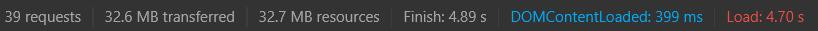
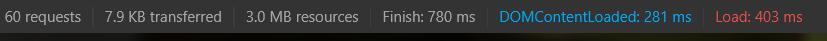

# Leaflet Vector Tiles - tối ưu hóa load Vector Tiles và Style Vector Tiles

So sánh trên cùng 1 bộ dữ liệu thảm thực vật, tổ chức thành 3 loại khác nhau:
 + Geojson thuần bình thường (nặng 115mb)
 + Topojson được convert từ Geojson (nặng 32mb, chuyển bằng Mapshaper: https://mapshaper.org/)
 + Mbtiles từ tile server (cảm ơn Soiqualang đã làm tool chuyển đổi từ Geojson sang Mbtiles) (nặng 9Mb)

##### Style Vector Tiles (pdf)
```
url_thamthucvat = "http://dev.dothanhlong.org/atlas_vietnam_tiles/t_thamthucvat/{z}/{x}/{y}.pbf";
function getColor_thamthucvat(d) {
        return d == "Rừng tự nhiên" ? "#00b81c" :
            d == "Rừng thưa" ? "#8aff78" :
                d == "Rừng tre nứa" ? "#e0ff22" :
                    d == "Rừng ngập mặn" ? "#989FC6" :
                        d == "Rừng ôn đới núi cao" ? "#6574AA" :
                            d == "Rừng trồng" ? "#c275ac" :
                                d == "Trảng cỏ, cây bụi" ? "#acffee" :
                                    d == "Thảm thực vật nông nghiệp" ? "#ffba7d" :
                                        d == "Loại khác" ? "#bf6737" :
                                            "#0000ff";
    }

    var style_thamthucvat = {
        thamthucvat: function (feat) {
            return {
                /* Thêm thuộc tính fill: true để thêm màu */
                fill: true,
                fillColor: getColor_thamthucvat(feat.type_ttv),
                weight: 0,
                color: "transparent",
                fillOpacity: 1
            }
        }
    }

    var view_thamthucvat = L.vectorGrid.protobuf(url_thamthucvat, {
        vectorTileLayerStyles: style_thamthucvat,
        maxNativeZoom: 14
    }).addTo(map);
```

##### Style Vector Tiles (topojson)
```
var parcels;
    var data = omnivore.topojson("thamthucvat.json");
    data.on('ready', function () {
        parcels = data.toGeoJSON();
        //console.log(parcels);
        buildMap();
    });

    function getColor_thamthucvat(d) {
        return d == "Rừng tự nhiên" ? "#00b81c" :
            d == "Rừng thưa" ? "#8aff78" :
                d == "Rừng tre nứa" ? "#e0ff22" :
                    d == "Rừng ngập mặn" ? "#989FC6" :
                        d == "Rừng ôn đới núi cao" ? "#6574AA" :
                            d == "Rừng trồng" ? "#c275ac" :
                                d == "Trảng cỏ, cây bụi" ? "#acffee" :
                                    d == "Thảm thực vật nông nghiệp" ? "#ffba7d" :
                                        d == "Loại khác" ? "#bf6737" :
                                            "#0000ff";
    }

    function buildMap() {
        var view_thamthucvat = L.vectorGrid.slicer(parcels, {
            rendererFactory: L.canvas.tile,
            vectorTileLayerStyles: {
                sliced: function (feat) {
                    return {
                        fill: true,
                        fillColor: getColor_thamthucvat(feat.type_ttv),
                        weight: 0,
                        color: "transparent",
                        fillOpacity: 1
                    }
                }
            },
            maxZoom: 22,
            indexMaxZoom: 5,
            interactive: true,
            getFeatureId: function (feat) {
                return feat.properties["type_ttv"]
            }
        }).addTo(map);
    }
```
##### Kết quả
 + GeoJSON thuần:
   + 
 + TopoJSON:
   + 
 + Mbtiles từ tile server:
   + 

##### Nhận xét
 + Ưu điểm
  + Dùng Mbtiles từ tile server cho tốc độ load rất nhanh (3mb, thời gian là dưới 1s - cụ thể là 780ms)
  + Dùng TopoJSON cho phép set mức zoom
 + Nhược điểm
  + Dùng Mbtiles từ tile server không thể set up zoom (muốn set up zoom phải làm từ bước chuyển đổi 
  từ Geojson sang Mbtiles rồi Config mức zoom, tuy nhiên dữ liệu khi set zoom sẽ lên rất lớn ~2Gb)
  + Dùng TopoJSON dung lượng tải tương đối cao, nhưng chậm hơn so với Geojson (32mb, thời gian là khoảng 5s)
  + Dùng GeoJSON dung lượng tải lớn (115mb, thời gian là khoảng 3s)
  
##### References
 + https://gis.stackexchange.com/questions/190390/loading-vector-tile-layer-in-leaflet-map
 + https://github.com/Leaflet/Leaflet.VectorGrid
 + https://leaflet.github.io/Leaflet.VectorGrid/demo-vectortiles.html
