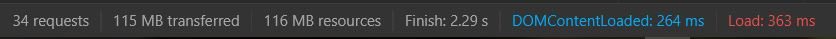

# Leaflet Vector Tiles - tối ưu hóa load Vector Tiles và Style Vector Tiles

So sánh trên cùng 1 bộ dữ liệu thảm thực vật, tổ chức thành 2 loại khác nhau:
 + Geojson thuần bình thường (nặng 115mb)
 + Mbtiles từ tile server (cảm ơn Soiqualang đã làm tool chuyển đổi từ Geojson sang Mbtiles)

Style Vector Tiles
```
url_thamthucvat = "http://dev.dothanhlong.org/atlas_vietnam_tiles/t_thamthucvat/{z}/{x}/{y}.pbf";
function getColor_thamthucvat(d) {
        return d == "Rừng tự nhiên" ? "#00b81c" :
            d == "Rừng thưa" ? "#8aff78" :
                d == "Rừng tre nứa" ? "#e0ff22" :
                    d == "Rừng ngập mặn" ? "#989FC6" :
                        d == "Rừng ôn đới núi cao" ? "#6574AA" :
                            d == "Rừng trồng" ? "#c275ac" :
                                d == "Trảng cỏ, cây bụi" ? "#acffee" :
                                    d == "Thảm thực vật nông nghiệp" ? "#ffba7d" :
                                        d == "Loại khác" ? "#bf6737" :
                                            "#0000ff";
    }

    var style_thamthucvat = {
        thamthucvat: function (feat) {
            return {
                /* Thêm thuộc tính fill: true để thêm màu */
                fill: true,
                fillColor: getColor_thamthucvat(feat.type_ttv),
                weight: 0,
                color: "transparent",
                fillOpacity: 1
            }
        }
    }

    var view_thamthucvat = L.vectorGrid.protobuf(url_thamthucvat, {
        vectorTileLayerStyles: style_thamthucvat,
        maxNativeZoom: 14
    }).addTo(map);
```

Kết quả:
 + Geojson thuần:
   + 
 + Mbtiles từ tile server:
   + 

References: 
 + https://gis.stackexchange.com/questions/190390/loading-vector-tile-layer-in-leaflet-map
 + https://github.com/Leaflet/Leaflet.VectorGrid
 + https://leaflet.github.io/Leaflet.VectorGrid/demo-vectortiles.html